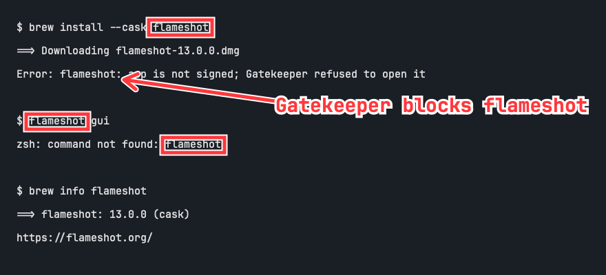

# annotate


Minimal macOS screenshot annotation tool. One Swift file, AppKit only, no
dependencies — compile it yourself and there is nothing to trust but Apple's
toolchain. Born out of [flameshot#4125](https://github.com/flameshot-org/flameshot/issues/4125).



## Install with Homebrew

```sh
brew install kaihendry/tap/annotate
```

This builds from a checksummed source release using Apple's Command Line Tools
and installs the `annotate-screenshot` command and app bundle. No `sudo` is needed.
The command name avoids a collision with Homebrew's `gd` package. Use
`annotate-screenshot` in place of `./annotate` in the examples below.

To launch from Finder or Spotlight, optionally add the app to your Applications folder:

```sh
mkdir -p ~/Applications
ln -s "$(brew --prefix kaihendry/tap/annotate)/Annotate.app" ~/Applications/Annotate.app
```

Update with `brew upgrade kaihendry/tap/annotate`.
The [tap repository](https://github.com/kaihendry/homebrew-tap) has maintenance
and uninstall instructions.

## Build from source

```sh
swiftc -O Annotate.swift -o annotate
```

## Use (GUI)

```sh
./annotate             # screenshot to clipboard (⌃⇧⌘4), annotate, ⌘Q → clipboard
./annotate shot.png    # annotate an existing file
```

Annotate never calls `screencapture` itself — on MDM-managed machines the
Screen Recording permission this needs is often blocked. Instead it rides on
the system screenshot tool: launch annotate, press ⌃⇧⌘4 and grab a region
(⌃ sends it to the clipboard), and the image loads automatically. If the
clipboard already holds an image at launch, it loads straight away.

On macOS 15.4+ the first auto-load triggers a one-time system alert asking
to allow annotate to paste from other apps — approve it (or set annotate to
Always Allow under System Settings → Privacy & Security). ⌘V always works
without any prompt.

| Key | Action |
|-----|--------|
| `B` / `A` / `T` | box / arrow / text tool (current tool shown in titlebar) |
| drag | draw box or arrow |
| click, type, `⏎` | place text (`⎋` cancels) |
| `⌘Z` | undo last shape |
| `⌘C` | copy annotated image |
| `⌘S` | save as PNG |
| `⌘Q` | quit — annotated image is copied to the clipboard automatically |

While entering text, `⌘V` pastes clipboard text at the cursor or replaces the
selection. `⌘A`, `⌘X`, and `⌘C` select all, cut, and copy text; `⌘Z` undoes
text edits. Outside text entry, `⌘C` copies the annotated image and `⌘V` loads
a clipboard image.

Shapes are red with a white halo, text is 28pt JetBrains Mono Bold (falls back
to system monospaced). Exports at full retina resolution.
Text always appears above boxes and arrows, including while drawing and in exports.

If red is too loud for your workplace, set any RRGGBB hex once:

```sh
defaults write com.hendry.annotate colour 0066FF   # corporate blue
defaults delete com.hendry.annotate colour         # back to red
```

or per run: `./annotate -colour 0066FF …` (GUI and headless alike). The white
halo stays, so any reasonably dark colour remains readable.

Images open pixel-true at the size you captured; anything bigger than the
screen is scaled to fit (no scrollbars) — pinch to zoom back in.

`make install` puts the CLI on your PATH and Annotate.app in /Applications,
so after ⌃⇧⌘4 just launch it from Spotlight (or any launcher) — the
screenshot loads itself.

The app bundle and CLI launches use a custom icon. `make icon` regenerates its
PNG preview and all macOS icon sizes using AppKit and `iconutil`.

## Use (headless, for scripts and agents)

Coordinates are image pixels, origin top-left — the same way vision models
report positions. Shape flags are repeatable.

```sh
./annotate in.png \
  --box   x,y,w,h \
  --arrow x1,y1,x2,y2 \
  --text  "x,y,label text" \
  --out   out.png
```

Text that would overflow the image is clamped inside it.

## Example: let Claude do the pointing

```sh
screencapture -i shot.png   # or any existing screenshot

claude -p 'Read shot.png and find every mention of "Flameshot".
Annotate them by running:
  ./annotate shot.png --box x,y,w,h --arrow x1,y1,x2,y2 --text "x,y,label" --out annotated.png
(flags repeatable; coordinates are pixels, origin top-left).
Box each mention, add one arrow + short label for the most important one.
Then read annotated.png back and re-run with corrected coordinates if
anything is misplaced.'
```

The read-back step is what makes this reliable: the model verifies its own
box placement visually and corrects itself. `test-terminal.png` /
`test-annotated.png` in this repo are the output of exactly this workflow.

## Test

`make test` runs native AppKit editing and clipboard regression checks on macOS.
It briefly opens a window and restores the clipboard afterward.
